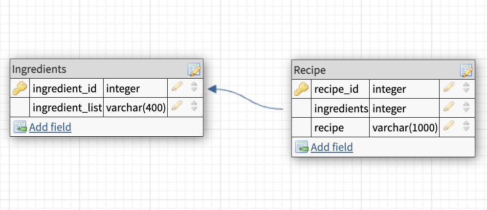

# FoodX

## Overview
Food Expert is a web app that simplifies cooking by generating personalized recipes based on the ingredients you already have. With a user-friendly interface, input ingredients you have on hand, and the AI-powered system will generate a recipe suggestion.

## Different Home Styling

## MVP
- User Input - Input field where users can input the ingredients they have on hand. It allows users to add a single ingredient or multiple ingredients

- OpenAI API Integration - Integrate ChatGPT’s API to send user inputs and retrieve recipe suggestions. Display the generated recipe on the web app

- Responsive UI - Responsive and user-friendly interface that adapts to different screen sizes

## Data Modeling

